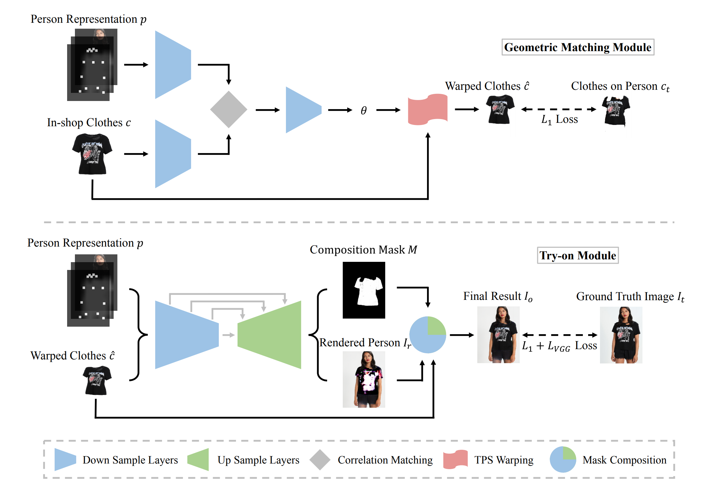

---
author:
- |
  Chia-Wei Chen\
  `cchen562@wisc.edu`
- |
  Yu-Huai Chen\
  `ychen874@wisc.edu`
- |
  Chung-Shien Luh\
  `luh@wisc.edu`
bibliography:
- papers.bib
date: March 31 2020
title: |
  Image-based Virtual Try-on Generator\
  CS766 Computer Vision Project Midterm Report
---

As our midterm report, we modified section
[3](#background){reference-type="ref" reference="background"}
Background, section [\[eval\]]{#eval label="eval"}, and section
[5](#dev-stone){reference-type="ref" reference="dev-stone"} Deliverables
& Milestone from our project proposal. We appended extra content
starting at section [6](#mid-report){reference-type="ref"
reference="mid-report"}.

Problem Statement
=================

In this project, we will focus on the evolution of the virtual try-on
systems using images of clothes on the Internet and photos of models
from e-commerce websites. We will divide developments of the project
into three stages. First, we focus on investigating methods with
traditional computer vision techniques that we have learned in class
such as image stitching and will analyze meaningful insights and
trade-off within these approaches. In the second stage, we will turn our
attention to the recent deep learning techniques in the virtual try-on
application. For example, using generative adversarial nets (GAN)
[@goodfellow2014generative] as a generative machine learning model to
synthesize virtual image of the model wearing some unseen clothes.
Finally, we will implement the current state-of-the-art virtual try-on
algorithm from top-tier research publications and evaluate its
reproduciblility.

Motivation
==========

![Virtual Dressing Room [@vdr]](fit-ar.jpg){width="30%"}

Nowadays, people are purchasing most of their items online and are
spending more on it especially in fashion items since browsing different
styles and categories of clothes is easy with just a few mouse clicks.
Despite the convenience that online shopping provides, customers tend to
concern about how a particular fashion item image on the website would
fit with themselves. Therefore, there is an urgent demand to provide a
quick and simple solution for virtual try-on. Instead of using 3D
information such as depth of the image, we believe simply rely on the
regular 2D photo is the most convenient way to satisfy this need. With
the recent progress in virtual try-on technologies, people can have a
better online shopping experience by accurately envisioning themselves
wearing the clothes from online categories. Furthermore, virtual try-on
technologies not only have demand in online shopping but also in
physical shopping. In other words, with the try-on technologies
developed on mobile application, customers can save their time of going
into the fitting room.

Background
==========

Seminal work on virtual fitting with traditional computer vision
techniques is DRAPE [@guan2012drape]. DRAPE model is trained with meshes
of pose of person and shapes of clothes. They utilized *shape
deformation gradients*, a linear transformation function that aims to
align triangles from source and target mesh, to represent deformation
between meshes. DRAPE applied the process of deformation due to body
shape, rigid part rotation, and body pose. Recent advances in machine
learning, in particular, deep neural networks forwards the performance
of virtual try-on systems significantly. VITON [@han2018viton] is a
virtual try-on network with an encoder-decoder generator as its core
component. Instead of accessing 3D information such as in previous
techniques [@guan2012drape], VITON only leveraged 2D information in its
virtual try-on network. Therefore, VITON reduces the resource footprint
and enables a broader set of applications. State-of-art methods such as
ClothFlow [@han2019clothflow] outperforms VITON by extending the
networks in VITON. In particular, ClothFlow divides the try-on framework
into three stages. (1) target segmentation map generation. (2)
refinement of geometric information in a cascaded warping manner. (3)
synthesis of the final result. These extra stages are shown to improve
the synthesis of photo-realistic images. In our study, we do not plan to
evaluate DARPE against recent deep learning approach such as VITON since
DARPE requires 3D meshes whereas VITON is targeted toward 2D image.
Instead, although not direcrtly related to your topic, we found a
project named E-dressing in the public domain which relies on
traditional machine learning techniques to realize virtual fitting room.

Evaluation {#eval}
==========

We will run VITON and test its performance on our own dataset crawled by
the web crawler we developed and examine the VITON's reproducibility. On
the other hand, we will investigate non-neural network techniques for
performing the task of virtual fitting.

We will apply the evaluation methods described by Han et al in
[@han2018viton]. In particular, we will use the VITON dataset we found
online and we will measure the inception score for both traditional
techniques and deep learning approach proposed in VITON. Inception score
is usually used to quantitatively evaluate the synthesis quality of
image generation models. Higher inception scores indicate the evaluated
model can produce visually diverse and semantically meaningful images
which demonstrates the generality of a given machine learning approach.

Deliverables & Milestones {#dev-stone}
=========================

Our plan is to start by investigating traditional computer vision
methods such as image stitching we learned in class and papers such as
DRAPE [@guan2012drape] and gradually move onto newer approaches such as
deep learning-based techniques. We will try to use pre-trained model if
provided for each methods before we try to re-implement the best or
current state-of-the-art method.

-   2/21: Read and research some more papers. Create a webpage or a
    shared media for documenting the project.

-   3/13: Finish investigations for traditional CV (DRAPE) vs. VITON /
    VITON-GAN vs. ClothFlow.

-   3/20: Start some re-implementation of state-of-the-art paper.

-   3/31: Finish Project Mid-Term Report.

-   4/10: Finish re-implementation and start evaluation and comparison
    for different datasets (VITON vs DeepFashion). Find ways to improve
    existing solutions.

-   4/27, 4/29, or 5/1: Wrap-up and finish slides for Final Project
    Presentations

-   5/4: Finish Project Webpage.

Midterm Report {#mid-report}
==============

E-Dressing
----------

We investigated E-Dressing [^1] which is a system that uses traditional
machine learning methods, in particular, an ensemble of regression trees
[@kazemi2014one], to perform the tasks of virtual try-on. However, after
experimenting with the system and running author-provided demos, we
would argue that E-Dressing is limited to try-on of items on faces. For
example, glasses and earrings. Although this does not align with our
original plan of the project, we see the possibility of integrating this
feature into our final system to have a full-body try-on feature since
CP-VTON (as described below) only support try-on of shirts. We will
continue our investigation of using traditional machine learning methods
for virtual try-on as the project progresses. Since the outcome of
E-Dressing is a bit disappointing, we spend the majority of our time on
CP-VTON as described below.

Data Preparation and Pre-Processing
-----------------------------------

In order to gather data for training and evaluation purposes. We have
implemented a scraper to scrape clothes images from E-Commerce websites.
After scraping the images, we found 2 major problems.

First, the clothes images are mixed with clothes only, clothes on model
front/side/back, detailed parts of the clothes, or even different
clothing combinations on the model, etc. We haven't find out an
automated way to pick out only the high quality clothes-only images yet,
but we plan to try out existing image classification services.

Second, most clothes images comes with background, and for our model we
need the background-removed image with a binary mask. Therefore, we
investigated and tried implementing several background-removal
techniques.

### Scraper for Clothes Images

We used Scrapy with Python and implemented a website crawler and
scraper. In particular, we targeted the E-Commerce website
https://uniqlo.com and scraped for their women's T-shirt images.

The major problem we faced here (aside from the two mentioned above) is
that the amount of women's T-shirts from any single seller is very
little, often only around a few hundred. If we want to get a large
amount of high-quality data, this method would not scale well.

### Image Background Removal

In order to remove background from images, we investigated both
traditional-CV methods and Machine-Learning methods. We found out that
although Machine-Learning methods generally performs better results, it
only works well on the same subject when it was trained. For example, a
library we tested[^2] which uses 100 layers of Tiramisu DensNet trained
on images with person works well on removing background from images that
contain one person, but performs terribly on even really easy
t-shirt-only images (Figure [2](#fig:bgrm-ml){reference-type="ref"
reference="fig:bgrm-ml"}).

{#fig:bgrm-ml width="100%"}
{#fig:bgrm-ml width="100%"}

Next we tried using traditional-CV methods for image background removal.
Specifically, we tried using Canny edge detection algorithm and Otsu's
thresholding algorithm, using OpenCV. The main problem is that although
this works reasonably well on some easy cases (clean monotonic
background with contrasted-colored t-shirt), it is hard to tune the
thresholds for every kind of t-shirt to have clean results.

We have created a simple web page[@opencvjswebsite] (online demo[^3])
using OpenCV.js, in order to visualize the effect of tuning
Brightness/Contrast together with comparing two algorithms mentioned
above, and to visually check each steps output to further improve the
algorithm pipelines. On this web page, we can test out different clothes
and change their brightness/contrast and toggle pipeline such as
morphing steps to see how they affect the generated contours and masks.
The screenshot result for the same easy t-shirt-only is shown in Figure
[3](#fig:bgrm-cv){reference-type="ref" reference="fig:bgrm-cv"}.

![Screenshot for website[@opencvjswebsite] to test background removal
using traditional CV methods](rmbg/cv-tshirt.png){#fig:bgrm-cv
width="100%"}

Images with more complex colors, lower contrast between clothes and
backgrounds, more shadows, etc. is still problematic and needs to be
improved.

CP-VTON
-------

We've reimplemented the paper (Toward Characteristic-Preserving
Image-based Virtual Try-On Network) method using the same dataset and
model settings.

### Dataset & Preprocessing

For the dataset, we use the same data provided by original VITON &
CP-VTON [^4], which use OpenPose[@cao2018openpose] for JSON format pose
information, and LIP\_JPPNet[@liang2018look] for model image
segmentation.

### Methodology

In CP-VTON, they use a two-stage solution to deal with the virtual
try-on problem. First, it learns a transformation for transforming the
clothes into fitting the body shape of the target person via a new
Geometric Matching Module (GMM). Second, to mitigate edge artifacts of
warped clothes and make the results more realistic, CP-VTON applies a
Try-On Module (TOM) that learns a combination mask to integrate the
warped clothes and the rendered image to ensure smoothness.\
**Geometric Matching Module (GMM)**

-   input: Person Representation $p$ (Keypoints + Segmentation + Human
    Model Image) + Cloth $c$

-   output: Warped Clothes $c'$

-   loss function: $L_{1}$ loss

**Try-On Module (TOM)**

-   input: Person Representation $p$ (Keypoints + Segmentation + Human
    Model Image) + Warped Clothes $c'$ (generated by GMM)

-   output: Human Model with warped cloth

-   loss function: $L_{1}$ + $L_{VGG}$ loss

{#fig:cp-vton
width="100%"}

### Evaluation {#evaluation}

We use provided dataset to evaluate the model result in Figure
[6](#fig:provided){reference-type="ref" reference="fig:provided"}.
Furthermore, we use our own data (Cloth + Human Model Image) to see the
model effect in Figure [8](#fig:our){reference-type="ref"
reference="fig:our"}.

We can see better try-on results in the provided dataset compared to
using our dataset. We guess it is due to the difference between training
and testing dataset properties. Since we crawl our dataset on the
Internet and doing minor preprocess (crop and resize), many aspects can
affect the original model inference such as image quality, background
removal, cloth texture varies in brands and so on. Moreover, we notice
that there's a limitation using CP-VTON i.e. it will transfer Human
Model's pants into different texture or even color.

{#fig:provided width="100%"}
{#fig:provided width="100%"}

{#fig:our
width="100%"} {#fig:our
width="100%"}

[^1]: <https://github.com/iamsusmitha/E-Dressing>

[^2]: <https://github.com/aadityavikram/Background-Removal>

[^3]: <https://opencv-js-background-removal.netlify.com/>

[^4]: <https://drive.google.com/open?id=1MxCUvKxejnwWnoZ-KoCyMCXo3TLhRuTo>
